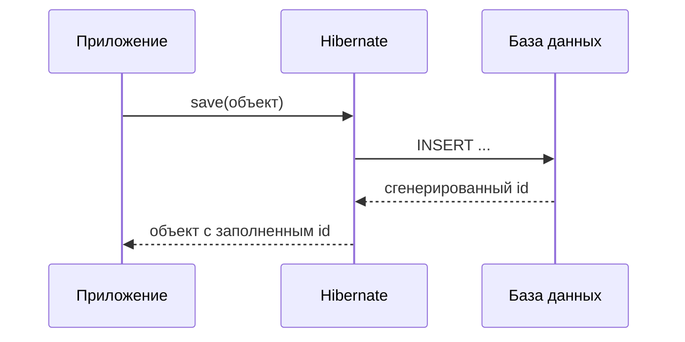
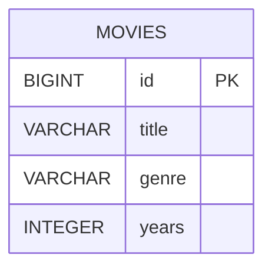
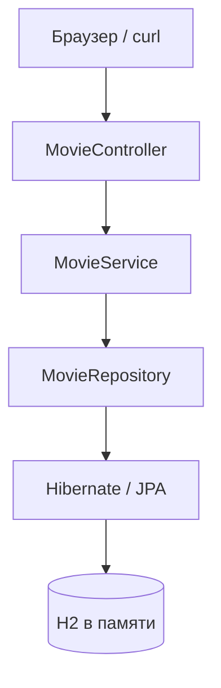

# springmovieapp  REST API каталога фильмов на Spring Boot


Лабораторная работа по курсу «Современные технологии программирования»: пошаговое создание веб-сервиса каталога **фильмов** (Spring Boot, JPA/Hibernate, H2, REST).

---

## Сводка аннотаций Spring

| Аннотация | Архитектурный слой | Назначение |
|-----------|------|-----------|
| `@SpringBootApplication` | запуск | main + автоконфигурация |
| `@Entity` | модель | класс Java ↔ таблица SQL |
| `JpaRepository` | БД | CRUD без своего SQL |
| `@Service` | логика | между контроллером и репозиторием |
| `@RestController` | HTTP | JSON на URL `/api/...` |
| `@Transactional` | транзакция | атомарная запись в БД |


---

## Содержание

1. [Введение](#1-введение)
2. [Необходимое программное обеспечение](#2-необходимое-программное-обеспечение)
2а. [Термины и сокращения](#2а-термины-и-сокращения)
3. [Теория: ORM  класс и таблица, объект и строка](#3-теория-orm--класс-и-таблица-объект-и-строка)
4. [Теория: аннотации и файл `.hbm.xml`](#4-теория-аннотации-и-файл-hbmxml)
5. [Теория: экосистема Spring](#5-теория-экосистема-spring)
6. [Теория: IoC, DI, стереотипные аннотации](#6-теория-ioc-di-стереотипные-аннотации)
7. [Теория: Spring Boot и встроенный Tomcat](#7-теория-spring-boot-и-встроенный-tomcat)
8. [Теория: AOP и `@Transactional`](#8-теория-aop-и-transactional)
9. [Схемы](#9-схемы)
10. [Структура проекта](#10-структура-проекта)
11. [Задание 1  создание проекта (Spring Initializr)](#11-задание-1--создание-проекта-spring-initializr)
12. [Задание 2  импорт в IntelliJ IDEA](#12-задание-2--импорт-в-intellij-idea)
13. [Задание 3  настройка H2 и JPA](#13-задание-3--настройка-h2-и-jpa)
14. [Задание 4  сущность Movie](#14-задание-4--сущность-movie)
15. [Задание 5  репозиторий](#15-задание-5--репозиторий)
16. [Задание 6  сервисный слой](#16-задание-6--сервисный-слой)
17. [Задание 7  REST-контроллер](#17-задание-7--rest-контроллер)
17а. [Задание  начальные данные `MovieDataLoader`](#17а-задание-начальные-данные-moviedataloader)
18. [Задание 8  запуск и проверка](#18-задание-8--запуск-и-проверка)
Контрольный [список файлов](#контрольный-список-файлов)
19. [Таблица REST-методов](#19-таблица-rest-методов)
20. [Материалы на проверку](#20-материалы-представляемые-на-проверку)
21. [Типичные ошибки сборки](#21-типичные-ошибки-сборки)
22. [Рекомендуемая литература](#22-рекомендуемая-литература)
23. [Публикация на GitHub](#23-публикация-на-github)

---

## 1. Введение

### 1.1. Связь с лабораторной работой 6

Лабораторная работа 6  JDBC и **Hibernate ORM** (`SessionFactory`, при необходимости `.hbm.xml`). Здесь  **Spring Boot**: автоконфигурация источника данных, **JPA** (`EntityManager`) и **Spring Data JPA** (интерфейсы репозитория).

### 1.2. Связь JDBC → Hibernate → Spring Data JPA

| Уровень | Технология | Ответственность разработчика |
|---------|------------|------------------------------|
| Низкий | JDBC | SQL, соединения, маппинг `ResultSet` вручную |
| Средний | Hibernate (JPA) | объекты и метаданные `@Entity`; SQL генерирует ORM |
| Высокий | Spring Data JPA | интерфейс репозитория; CRUD и запросы по имени метода |

### 1.3. Цель и задачи

**Цель:** сформировать навыки разработки REST веб-сервиса с ORM на базе Spring Boot.

**Задачи:**

1. Создать Maven-проект с зависимостями Web, Data JPA, H2.
2. Настроить in-memory базу данных и параметры JPA.
3. Реализовать сущность, репозиторий, сервис и контроллер.
4. Провести функциональную проверку API и проанализировать генерируемый SQL.

---

## 2. Необходимое программное обеспечение

| Компонент | Версия / примечание |
|-----------|---------------------|
| JDK | OpenJDK **23** (Spring Boot 3.4 поддерживает 17–23) |
| IDE | IntelliJ IDEA Community 2025+ |
| Сборка | Maven 3.9+ |
| Знания | Java, Maven, основы SQL из лабораторной 6 |
| Проверка API | браузер, curl или Postman |

**Важно.** Команда `mvn` использует `JAVA_HOME`. Spring Boot 3.x требует JDK **17+** (байткод 61+). При запуске Maven под Java 8 возникает ошибка `class file has wrong version 61.0, should be 52.0`. В IntelliJ: **File → Project Structure → SDK = 23**; **Settings → Build Tools → Maven → Runner → Project JDK**.

---

## 2а. Термины и сокращения

| Термин | Определение |
|--------|-------------|
| **ORM** | Object-Relational Mapping  отображение объектной модели на реляционную схему БД |
| **JPA** | Jakarta Persistence API  стандарт Java для ORM (аннотации `@Entity`, `@Id`, …) |
| **Hibernate** | реализация JPA и собственного API ORM; в Spring Boot используется как JPA-провайдер |
| **Сущность (entity)** | класс, помеченный `@Entity`, экземпляры которого соответствуют строкам таблицы |
| **Spring Data JPA** | подсистема Spring для репозиториев поверх `EntityManager` |
| **IoC** | Inversion of Control  создание и связывание объектов выполняет контейнер Spring |
| **DI** | Dependency Injection  передача зависимостей извне (в работе  через конструктор) |
| **REST** | архитектурный стиль обмена данными по HTTP (в работе  JSON) |

---

## 3. Теория: ORM  класс и таблица, объект и строка

**ORM (Object-Relational Mapping)**  технология согласования **объектной модели** (классы Java) и **реляционной модели** (таблицы SQL). В данном проекте ORM обеспечивается связкой **JPA (спецификация) + Hibernate (реализация) + Spring Data JPA (удобный API репозитория)**.


### 3.1. Один класс  одна таблица

Аннотация `@Entity` (JPA) регистрирует класс как **сущность**: экземпляры класса отображаются на строки **одной** таблицы.

| Элемент в Java | Элемент в реляционной модели |
|----------------|------------------------------|
| `class Movie` | таблица `movies` (задаётся `@Table(name = "movies")`) |
| поле `Long id` с `@Id` | столбец первичного ключа |
| поле `String title` | название фильма |
| поле `String genre` | жанр |
| поле `Integer years` | год выпуска (столбец `years`, не `year`) |

Имена таблицы и столбцов в SQL определяются Hibernate; фактический DDL  в консоли (`show-sql`) или в H2 (`SHOW TABLES`).

Смена СУБД (H2, PostgreSQL, MySQL и др.) **не требует** изменения Java-кода сущности. Изменяются URL, драйвер JDBC и **диалект** Hibernate в `application.properties`.

| СУБД | Пример URL |
|------|------------|
| H2 | `jdbc:h2:mem:moviesdb` |
| PostgreSQL | `jdbc:postgresql://localhost:5432/имя_бд` |
| MySQL | `jdbc:mysql://localhost:3306/имя_бд` |

### 3.2. Один объект  одна строка

В JDBC вы выполняете:

```sql
INSERT INTO movies (title, genre, years) VALUES ('Матрица', 'Sci-Fi', 1999);
```

В ORM вы создаёте **объект** и вызываете:

```java
Movie movie = new Movie();
movie.setTitle("Матрица");
movie.setGenre("Sci-Fi");
movie.setYears(1999);
repository.save(movie);  // Hibernate выполнит INSERT; id заполнится после сохранения
```

| Действие в коде | Действие в БД |
|-----------------|---------------|
| `new Movie()` | объект только в памяти (ещё нет строки) |
| `repository.save(n)` | `INSERT`  появляется **новая строка** |
| `repository.findById(1L)` | `SELECT`  из строки строится **объект** |
| `repository.deleteById(1L)` | `DELETE`  строка удаляется |

### 3.3. Состояния сущности JPA

В спецификации JPA экземпляр сущности может находиться в одном из состояний:

| Состояние | Условие | Связь со строкой БД |
|-----------|---------|---------------------|
| **Transient (новый)** | `id == null`, объект не управляется ORM | строки в БД **нет** |
| **Managed (управляемый)** | объект в контексте персистентности внутри транзакции | соответствует строке; изменения могут синхронизироваться |
| **Detached (отсоединённый)** | был загружен, контекст закрыт | строка в БД есть, объект в памяти не синхронизируется автоматически |
| **Removed (удалённый)** | помечен к удалению в контексте | строка будет удалена при commit |

Пример: `new Movie()`  **transient**; после `repository.save()` при успешной транзакции объект становится **managed**, в БД появляется или обновляется **строка**.

Метод `save` в Spring Data JPA для новой сущности (`id == null`) приводит к операции **persist** (INSERT); для существующего идентификатора  к **merge** (часто UPDATE).

### 3.4. Сравнение JDBC и ORM

**JDBC (вручную):**

```java
String sql = "INSERT INTO movies (title, genre, years) VALUES (?, ?, ?)";
PreparedStatement ps = conn.prepareStatement(sql, Statement.RETURN_GENERATED_KEYS);
ps.setString(1, "Матрица");
ps.setString(2, "Sci-Fi");
ps.setInt(3, 1999);
ps.executeUpdate();
```

**ORM (Spring Data JPA):**

```java
Movie movie = new Movie(null, "Матрица", "Sci-Fi", 1999);
Movie saved = repository.save(movie);
Long id = saved.getId();
```

Разработчик оперирует **объектами**; SQL формирует Hibernate. При `spring.jpa.show-sql=true` запросы видны в консоли  это помогает понять механизм ORM.



---

## 4. Теория: аннотации JPA и файл `.hbm.xml`

Метаданные ORM задают соответствие **класс ↔ таблица**, **поле ↔ столбец**. В Java используют два подхода:

### 4.1. Аннотации JPA

```java
@Entity
@Table(name = "movies")
public class Movie {
    @Id
    @GeneratedValue(strategy = GenerationType.IDENTITY)
    private Long id;
    private String title;
    private String genre;
    @Column(name = "years")
    private Integer years;
}
```

| Аннотация | Назначение |
|-----------|------------|
| `@Entity` | класс отображается на таблицу |
| `@Id` | первичный ключ |
| `@GeneratedValue` | автоувеличение id |
| `@Column`, `@Table` | при необходимости  явные имена столбца и таблицы |

### 4.2. XML-файл `.hbm.xml` (лабораторная работа 6)

```xml
<?xml version="1.0" encoding="UTF-8"?>
<!DOCTYPE hibernate-mapping PUBLIC
        "-//Hibernate/Hibernate Mapping DTD 3.0//EN"
        "http://www.hibernate.org/dtd/hibernate-mapping-3.0.dtd">
<hibernate-mapping>
    <class name="com.example.springmovieapp.model.Movie"
           table="movies">
        <id name="id" column="id" type="long">
            <generator class="identity"/>
        </id>
        <property name="title" column="title" type="string"/>
        <property name="genre" column="genre" type="string"/>
        <property name="years" column="years" type="integer"/>
    </class>
</hibernate-mapping>
```

Подключение в `hibernate.cfg.xml`:

```xml
<mapping resource="Movie.hbm.xml"/>
```

Аннотации JPA и XML `.hbm.xml` описывают одну и ту же сущность разными способами. В Spring Boot 3 используется маппинг **аннотациями**; XML применялся в лабораторной работе 6.

---

## 5. Теория: экосистема Spring

| Технология | Уровень | Назначение |
|------------|---------|------------|
| Spring Framework | базовый | IoC-контейнер, MVC, транзакции, интеграции |
| Spring Boot | надстройка | автоконфигурация, встроенный сервер, соглашения |
| Spring MVC | веб-модуль | `DispatcherServlet`, контроллеры, HTTP-маппинг |
| Spring Data JPA | доступ к данным | репозитории, запросы по именам методов, интеграция с `EntityManager` |

Spring Boot **не заменяет** Spring Framework, а упрощает его конфигурирование для типовых приложений.

---

## 6. Теория: IoC, DI, стереотипные аннотации

**Инверсия управления (IoC)**  принцип, при котором управление жизненным циклом объектов и графом зависимостей передано **контейнеру** Spring, а не прикладному коду.

**Внедрение зависимостей (DI)**  конкретный механизм IoC: зависимости передаются в объект (конструктор, сеттер или поле). В проекте  **внедрение через конструктор** (`@RequiredArgsConstructor`, поля `final`).

| Аннотация | Слой |
|-----------|------|
| `@Component` | общий компонент Spring |
| `@Service` | бизнес-логика |
| `@Repository` | доступ к данным |
| `@RestController` | REST API (JSON) |

---

## 7. Теория: Spring Boot и встроенный Tomcat

Вызов `SpringApplication.run(...)` запускает встроенный сервлет-контейнер **Tomcat** на порту **8080** в том же процес JVM. Отдельная установка Tomcat не требуется.

---

## 8. Теория: AOP и `@Transactional`

**AOP (Aspect-Oriented Programming)** позволяет вынести сквозную функциональность (транзакции, логирование) из бизнес-методов.

Аннотация `@Transactional` (Spring) на методах `save` и `delete` обеспечивает выполнение в **одной транзакции БД** через **прокси** бина:

- при нормальном завершении  `commit`;
- при **непроверенном** исключении (`RuntimeException` и по умолчанию `Error`)  `rollback`;
- проверенные (`checked`) исключения по умолчанию **не** вызывают откат (если не настроить `rollbackFor`).

Таким образом, несколько операций с БД в одном `@Transactional`-методе выполняются атомарно.

---

## 9. Схемы

### ER-диаграмма



### Слои приложения



---

## 10. Структура проекта

Создайте каталог `springmovieapp` и сформируйте структуру каталогов согласно таблице.

| Путь | Задание |
|------|---------|
| `pom.xml` | 11 |
| `src/main/resources/application.properties` | 13 |
| `src/main/java/.../model/Movie.java` | 14 |
| `src/main/java/.../repository/MovieRepository.java` | 15 |
| `src/main/java/.../service/MovieService.java` | 16 |
| `src/main/java/.../controller/MovieController.java` | 17 |
| `src/main/java/.../controller/HomeController.java` | 17 |
| `src/main/java/.../config/MovieDataLoader.java` | 17а |
| `src/main/java/.../SpringmovieappApplication.java` | 18 |
| `src/test/java/.../SpringmovieappApplicationTests.java` | 18 |

В IntelliJ: **New → Package** на каталоге `java` (например, `com.example.springmovieapp.model`).

---

## Контрольный список файлов

Перед сдачей убедитесь, что реализованы все перечисленные файлы:

| ✓ | Файл |
|---|------|
| ☐ | `pom.xml` |
| ☐ | `src/main/resources/application.properties` |
| ☐ | `.../SpringmovieappApplication.java` |
| ☐ | `.../model/Movie.java` |
| ☐ | `.../repository/MovieRepository.java` |
| ☐ | `.../service/MovieService.java` |
| ☐ | `.../controller/MovieController.java` |
| ☐ | `.../controller/HomeController.java` |
| ☐ | `.../config/MovieDataLoader.java` |
| ☐ | `.../SpringmovieappApplicationTests.java` |

Команда проверки сборки: `mvn clean compile` в папке с `pom.xml`.

---

## 11. Задание 1  создание проекта (Spring Initializr)

| | |
|---|---|
| **Цель** | получить Maven-проект с зависимостями Web, Data JPA, H2, Lombok |
| **Проверка** | в корне есть `pom.xml`; `mvn -q -DskipTests compile` завершается без ошибок |

### Шаг 1  генератор start.spring.io

1. Откройте https://start.spring.io  
2. **Project:** Maven · **Language:** Java · **Spring Boot:** 3.4.2 (или 3.4.x)  
3. **Group:** `com.example` · **Artifact:** `springmovieapp`  
4. **Name:** springmovieapp · **Package name:** `com.example.springmovieapp`  
5. **Packaging:** Jar · **Java:** 23 (или 21, если 23 недоступен)  
6. **Dependencies:** Spring Web, Spring Data JPA, H2 Database, Lombok  
7. **GENERATE** → распакуйте ZIP в папку `springmovieapp`

### Шаг 2  замените `pom.xml` целиком

Сервис Spring Initializr формирует базовый файл `pom.xml`. Замените его содержимое полностью следующим фрагментом (версия Lombok 1.18.38 и режим `proc:full` необходимы для JDK 23–26):

```xml
<?xml version="1.0" encoding="UTF-8"?>
<project xmlns="http://maven.apache.org/POM/4.0.0"
         xmlns:xsi="http://www.w3.org/2001/XMLSchema-instance"
         xsi:schemaLocation="http://maven.apache.org/POM/4.0.0 https://maven.apache.org/xsd/maven-4.0.0.xsd">
    <modelVersion>4.0.0</modelVersion>

    <parent>
        <groupId>org.springframework.boot</groupId>
        <artifactId>spring-boot-starter-parent</artifactId>
        <version>3.4.2</version>
        <relativePath/>
    </parent>

    <groupId>com.example</groupId>
    <artifactId>springmovieapp</artifactId>
    <version>0.0.1-SNAPSHOT</version>
    <name>springmovieapp</name>
    <description>REST API каталога фильмов</description>

    <properties>
        <java.version>23</java.version>
        <lombok.version>1.18.38</lombok.version>
        <maven.compiler.proc>full</maven.compiler.proc>
    </properties>

    <dependencies>
        <dependency>
            <groupId>org.springframework.boot</groupId>
            <artifactId>spring-boot-starter-web</artifactId>
        </dependency>
        <dependency>
            <groupId>org.springframework.boot</groupId>
            <artifactId>spring-boot-starter-data-jpa</artifactId>
        </dependency>
        <dependency>
            <groupId>com.h2database</groupId>
            <artifactId>h2</artifactId>
            <scope>runtime</scope>
        </dependency>
        <dependency>
            <groupId>org.projectlombok</groupId>
            <artifactId>lombok</artifactId>
            <version>${lombok.version}</version>
            <optional>true</optional>
        </dependency>
        <dependency>
            <groupId>org.springframework.boot</groupId>
            <artifactId>spring-boot-starter-test</artifactId>
            <scope>test</scope>
        </dependency>
    </dependencies>

    <build>
        <plugins>
            <plugin>
                <groupId>org.springframework.boot</groupId>
                <artifactId>spring-boot-maven-plugin</artifactId>
                <configuration>
                    <jvmArguments>--enable-native-access=ALL-UNNAMED</jvmArguments>
                    <excludes>
                        <exclude>
                            <groupId>org.projectlombok</groupId>
                            <artifactId>lombok</artifactId>
                        </exclude>
                    </excludes>
                </configuration>
            </plugin>
            <plugin>
                <groupId>org.apache.maven.plugins</groupId>
                <artifactId>maven-compiler-plugin</artifactId>
                <version>3.13.0</version>
                <configuration>
                    <proc>full</proc>
                    <annotationProcessorPaths>
                        <path>
                            <groupId>org.projectlombok</groupId>
                            <artifactId>lombok</artifactId>
                            <version>${lombok.version}</version>
                        </path>
                    </annotationProcessorPaths>
                </configuration>
            </plugin>
        </plugins>
    </build>
</project>
```

### Шаг 3  проверка

```bash
cd springmovieapp
mvn -q -DskipTests compile
```

Для JDK 26 в Run Configuration укажите VM option `--enable-native-access=ALL-UNNAMED` ([§21.2](#212-jdk-26-предупреждение-tomcat-restricted-method-systemload)).

---

## 12. Задание 2  импорт в IntelliJ IDEA

| | |
|---|---|
| **Цель** | открыть проект и дождаться индексации Maven |
| **Проверка** | в структуре проекта отображаются `src/main/java` и класс `SpringmovieappApplication` |

**Шаги:**

1. **File → Open** → каталог проекта, содержащий файл `pom.xml`.  
2. Дождитесь завершения загрузки зависимостей Maven.  
3. **File → Project Structure → Project** → SDK = **23** (или 17+).  
4. **Settings → Build Tools → Maven → Runner** → JRE = **Project SDK**.  
5. Убедитесь, что есть класс `com.example.springmovieapp.SpringmovieappApplication`.

---

## 13. Задание 3  настройка H2 и JPA

| | |
|---|---|
| **Цель** | подключить in-memory БД и включить вывод SQL |
| **Проверка** | после запуска в консоли есть строки `Hibernate:`; H2-console открывается |

**Файл:** `src/main/resources/application.properties`

**Полное содержимое:**

```properties
spring.application.name=springmovieapp

spring.datasource.url=jdbc:h2:mem:moviesdb
spring.datasource.driverClassName=org.h2.Driver
spring.datasource.username=sa
spring.datasource.password=

spring.h2.console.enabled=true
spring.h2.console.path=/h2-console

spring.jpa.show-sql=true
spring.jpa.hibernate.ddl-auto=update
spring.jpa.open-in-view=false

logging.level.org.hibernate.SQL=DEBUG
```

| Параметр | Пояснение |
|----------|-----------|
| `jdbc:h2:mem:moviesdb` | БД в оперативной памяти; данные исчезают после остановки приложения |
| `ddl-auto=update` | Hibernate создаёт/обновляет таблицы по классам `@Entity` |
| `show-sql=true` | вывод SQL в консоль |

**Вход в консоль H2:** URL `jdbc:h2:mem:moviesdb`, пользователь `sa`, пароль пустой.

JDBC URL в H2-console: `jdbc:h2:mem:moviesdb` (приложение должно быть запущено; после остановки данные в `mem` удаляются).

---

## 14. Задание 4  сущность Movie

| | |
|---|---|
| **Цель** | описать предметную область как JPA-сущность и установить соответствие класс ↔ таблица |
| **Критерий выполнения** | приложение запускается; в консоли виден DDL создания таблицы `movies` |

**Пакет:** `com.example.springmovieapp.model`  
**Файл:** `Movie.java`

Поле называется `years` (не `year`): `@Column(name = "years")`.

```java
package com.example.springmovieapp.model;

import jakarta.persistence.Column;
import jakarta.persistence.Entity;
import jakarta.persistence.GeneratedValue;
import jakarta.persistence.GenerationType;
import jakarta.persistence.Id;
import jakarta.persistence.Table;
import lombok.AllArgsConstructor;
import lombok.Getter;
import lombok.NoArgsConstructor;
import lombok.Setter;
import lombok.ToString;

@Entity
@Table(name = "movies")
@Getter
@Setter
@NoArgsConstructor
@AllArgsConstructor
@ToString
public class Movie {

    @Id
    @GeneratedValue(strategy = GenerationType.IDENTITY)
    private Long id;

    @Column(nullable = false, length = 255)
    private String title;

    @Column(nullable = false, length = 100)
    private String genre;

    @Column(name = "years", nullable = false)
    private Integer years;
}
```

| Элемент | Смысл в ORM |
|---------|-------------|
| `@Entity` | класс ↔ таблица |
| `@Id` | первичный ключ |
| `@GeneratedValue` | автоинкремент при INSERT |
| `@NoArgsConstructor` | обязателен для JPA |

После запуска приложения Hibernate создаст таблицу (см. SQL в консоли).

---

## 15. Задание 5  репозиторий

| | |
|---|---|
| **Цель** | получить CRUD без написания SQL |
| **Проверка** | интерфейс компилируется; после запуска `repository.save()` работает |

**Пакет:** `com.example.springmovieapp.repository`

```java
package com.example.springmovieapp.repository;

import com.example.springmovieapp.model.Movie;
import org.springframework.data.jpa.repository.JpaRepository;

import java.util.List;

public interface MovieRepository extends JpaRepository<Movie, Long> {

    List<Movie> findByGenre(String genre);
}
```

Наследуются методы: `save`, `findAll`, `findById`, `deleteById`, `existsById`. Реализацию писать **не нужно**  её создаёт Spring Data JPA.

Метод `findByGenre`  запрос по имени: Spring формирует `WHERE genre = ?`.

---

## 16. Задание 6  сервисный слой

| | |
|---|---|
| **Цель** | вынести работу с БД из контроллера; задать границы транзакций |
| **Проверка** | контроллер вызывает только `MovieService`, не `MovieRepository` напрямую |

**Пакет:** `com.example.springmovieapp.service`

```java
package com.example.springmovieapp.service;

import com.example.springmovieapp.model.Movie;
import com.example.springmovieapp.repository.MovieRepository;
import lombok.RequiredArgsConstructor;
import org.springframework.stereotype.Service;
import org.springframework.transaction.annotation.Transactional;

import java.util.List;
import java.util.Optional;

@Service
@RequiredArgsConstructor
public class MovieService {

    private final MovieRepository repo;

    public List<Movie> getAll() {
        return repo.findAll();
    }

    public Optional<Movie> getById(Long id) {
        return repo.findById(id);
    }

    @Transactional
    public Movie save(Movie movie) {
        return repo.save(movie);
    }

    @Transactional
    public void delete(Long id) {
        if (!repo.existsById(id)) {
            throw new RuntimeException("Фильм с id=" + id + " не найден");
        }
        repo.deleteById(id);
    }
}
```

Метод `save` передаёт **объект** в репозиторий; Hibernate синхронизирует его со **строкой** таблицы.

---

## 17. Задание 7  REST-контроллер

| | |
|---|---|
| **Цель** | открыть API наружу по HTTP |
| **Проверка** | GET `/api/movies` возвращает JSON (не HTML-ошибку) |

**Пакет:** `com.example.springmovieapp.controller`

```java
package com.example.springmovieapp.controller;

import com.example.springmovieapp.model.Movie;
import com.example.springmovieapp.service.MovieService;
import lombok.RequiredArgsConstructor;
import org.springframework.http.ResponseEntity;
import org.springframework.web.bind.annotation.*;

import java.util.List;

@RestController
@RequestMapping("/api/movies")
@RequiredArgsConstructor
public class MovieController {

    private final MovieService service;

    @GetMapping
    public List<Movie> getAll() {
        return service.getAll();
    }

    @GetMapping("/{id}")
    public ResponseEntity<Movie> getById(@PathVariable Long id) {
        return service.getById(id)
                .map(ResponseEntity::ok)
                .orElse(ResponseEntity.notFound().build());
    }

    @PostMapping
    public ResponseEntity<Movie> create(@RequestBody Movie movie) {
        Movie saved = service.save(movie);
        return ResponseEntity.ok(saved);
    }

    @DeleteMapping("/{id}")
    public ResponseEntity<Void> delete(@PathVariable Long id) {
        service.delete(id);
        return ResponseEntity.noContent().build();
    }
}
```

**Дополнительно**  перенаправление с главной страницы (`HomeController.java`):

```java
package com.example.springmovieapp.controller;

import org.springframework.stereotype.Controller;
import org.springframework.web.bind.annotation.GetMapping;

@Controller
public class HomeController {

    @GetMapping("/")
    public String home() {
        return "redirect:/api/movies";
    }
}
```

---

## 17а. Задание  начальные данные `MovieDataLoader`

| | |
|---|---|
| **Цель** | загрузить тестовые записи при старте приложения |
| **Проверка** | запрос GET `/api/movies` возвращает JSON-массив из трёх элементов |

**Пакет:** `com.example.springmovieapp.config`  
**Файл:** `MovieDataLoader.java`

```java
package com.example.springmovieapp.config;

import com.example.springmovieapp.model.Movie;
import com.example.springmovieapp.repository.MovieRepository;
import lombok.RequiredArgsConstructor;
import org.springframework.boot.CommandLineRunner;
import org.springframework.stereotype.Component;

@Component
@RequiredArgsConstructor
public class MovieDataLoader implements CommandLineRunner {

    private final MovieRepository repository;

    @Override
    public void run(String... args) {
        if (repository.count() == 0) {
            repository.save(new Movie(null, "Матрица", "Sci-Fi", 1999));
            repository.save(new Movie(null, "Начало", "Sci-Fi", 2010));
            repository.save(new Movie(null, "Король Лев", "Animation", 1994));
        }
    }
}
```

Выполнение задания не обязательно: тестовые данные можно внести через консоль H2 или метод POST (раздел 18).

---

## 18. Задание 8  запуск и проверка

| | |
|---|---|
| **Цель** | запустить приложение и убедиться, что все слои работают |
| **Проверка** | скриншоты: консоль, браузер `/api/movies`, H2, curl POST/DELETE |

При Whitelabel Error Page откройте `/api/movies` (не `/`). Маршрут `/` перенаправляется `HomeController`.

### 8.1. Главный класс

Класс `SpringmovieappApplication` генерируется Spring Initializr по пути  
`src/main/java/com/example/springmovieapp/SpringmovieappApplication.java`.  
Проверьте соответствие следующему фрагменту:

```java
package com.example.springmovieapp;

import org.springframework.boot.SpringApplication;
import org.springframework.boot.autoconfigure.SpringBootApplication;

@SpringBootApplication
public class SpringmovieappApplication {

    public static void main(String[] args) {
        SpringApplication.run(SpringmovieappApplication.class, args);
    }
}
```

### 8.2. Тест загрузки контекста Spring

`src/test/java/com/example/springmovieapp/SpringmovieappApplicationTests.java`:

```java
package com.example.springmovieapp;

import org.junit.jupiter.api.Test;
import org.springframework.boot.test.context.SpringBootTest;

@SpringBootTest
class SpringmovieappApplicationTests {

    @Test
    void contextLoads() {
    }
}
```

Запуск: `mvn test`  тест должен пройти.

### 8.3. Запуск приложения

```bash
# выполните в каталоге с pom.xml (корень репозитория)
mvn spring-boot:run
```

В консоли должно появиться: `Started SpringmovieappApplication in ... seconds`

### 8.4. Проверка в браузере

| URL | Ожидаемый результат |
|-----|---------------------|
| http://localhost:8080/api/movies | JSON-массив (3 фильма из `MovieDataLoader` или `[]` без загрузчика) |
| http://localhost:8080/h2-console | форма подключения к БД |

**Вставка данных через H2** (сначала выполните `SHOW TABLES;` и подставьте фактическое имя таблицы):

```sql
INSERT INTO movies (title, genre, years) VALUES ('Матрица', 'Sci-Fi', 1999);
INSERT INTO movies (title, genre, years) VALUES ('Начало', 'Sci-Fi', 2010);
```

Обновите страницу `http://localhost:8080/api/movies`  отобразится JSON-массив **объектов**, построенных из **строк** таблицы.

### 8.5. Проверка curl

```bash
curl -X POST http://localhost:8080/api/movies -H "Content-Type: application/json" -d "{\"title\":\"Через curl\", \"genre\":\"Drama\", \"years\": 2020}"
```

```bash
curl -X DELETE http://localhost:8080/api/movies/2
```

В консоли IntelliJ отобразятся строки вида `Hibernate: insert into movies ...`  это работа ORM.

---

## 19. Таблица REST-методов

| HTTP | Путь | Описание | Браузер |
|------|------|----------|---------|
| GET | `/api/movies` | список всех | да |
| GET | `/api/movies/{id}` | одно по id | да |
| POST | `/api/movies` | создание | curl / Postman |
| DELETE | `/api/movies/{id}` | удаление | curl / Postman |
|  | `/h2-console` | SQL-консоль | да |

---

## 20. Материалы, представляемые на проверку

1. Исходный код Maven-проекта `springmovieapp` (архив ZIP или репозиторий Git).  
2. Скриншоты: журнал запуска (`Started SpringmovieappApplication`); ответ REST API (`/api/movies`); консоль H2 с таблицей `movies`; выполнение команд POST и DELETE.  
3. Ответы на контрольные вопросы (формат  [`answers/otvety.md`](answers/otvety.md)).

Критерии полноты реализации: наличие всех компонентов из [контрольного списка](#контрольный-список-файлов) и работоспособность REST API.

---

## 21. Типичные ошибки сборки

| Ошибка | Причина | Решение |
|--------|---------|---------|
| `wrong version 61.0, should be 52.0` | Maven под Java 8 | JDK 23, Maven Runner → Project JDK |
| Не находится `jakarta` | JDK &lt; 17 | Установить JDK 17+ |
| Whitelabel Error Page | неверный URL | `/api/movies` |
| Lombok подчёркнут красным | плагин выключен | Lombok + annotation processing |
| В H2 нет таблицы / `Table "movies" not found` | неверный JDBC URL или приложение не запущено | `jdbc:h2:mem:moviesdb`, приложение запущено; `SHOW TABLES` |
| `TypeTag :: UNKNOWN` / `ExceptionInInitializerError` (javac) | старый **Lombok** или JDK 23+ без `proc:full` | см. [§21.1](#211-ошибка-typetag--unknown-lombok--jdk-23) |

### 21.1. Ошибка `TypeTag :: UNKNOWN` (Lombok + JDK 23+)

**Симптом в IntelliJ:**

```text
java: java.lang.ExceptionInInitializerError
com.sun.tools.javac.code.TypeTag :: UNKNOWN
```

**Причина:** процессор аннотаций Lombok несовместим с компилятором JDK 23 (или 24/25), либо в Maven не включена полная обработка аннотаций.

**Решение (см. задание 11):**

- свойство `lombok.version` = **1.18.38**;
- плагин `maven-compiler-plugin` версии **3.13.0** с параметром `<proc>full</proc>`.

**В IntelliJ IDEA дополнительно:**

1. **File → Invalidate Caches → Invalidate and Restart** (после обновления `pom.xml`).  
2. Правый клик по `pom.xml` → **Maven → Reload project**.  
3. **Settings → Plugins** → обновить плагин **Lombok** до последней версии.  
4. **Settings → Build, Execution, Deployment → Compiler → Annotation Processors** → **Enable annotation processing**.  
5. **File → Project Structure → Project** → SDK = тот же JDK, что и для Maven (17–25).  
6. **Settings → Build Tools → Maven → Runner** → JRE = **Project SDK**.

**Проверка в терминале:**

```bash
mvn -q clean compile
```

Если в терминале сборка успешна, а в IDE  нет, проблема в настройках IntelliJ (п. 1–6), а не в коде.

**Альтернатива:** при использовании JDK 21 укажите в `pom.xml` элемент `<java.version>21</java.version>` (Spring Boot 3.4 поддерживает LTS-версии 17 и 21).

### 21.2. JDK 26: предупреждение Tomcat `restricted method System::load`

Если в логе есть:

```text
WARNING: A restricted method in java.lang.System has been called
WARNING: Use --enable-native-access=ALL-UNNAMED
```

данное сообщение **не является ошибкой**; приложение продолжает работу при наличии записи `Started SpringmovieappApplication` в журнале.

**IntelliJ:** Run → Edit Configurations → `SpringmovieappApplication` → **VM options:**

```text
--enable-native-access=ALL-UNNAMED
```

**Запуск через Maven:** параметр JVM задаётся в конфигурации `spring-boot-maven-plugin` (задание 11).

**Проверка:** GET http://localhost:8080/api/movies  ожидается JSON-массив из трёх записей, загруженных компонентом `MovieDataLoader`.

---

## 22. Рекомендуемая литература

1. Jakarta Persistence (JPA) 3.1  спецификация: https://jakarta.ee/specifications/persistence/3.1/  
2. Spring Boot 3.4 Reference  https://docs.spring.io/spring-boot/docs/current/reference/html/  
3. Spring Data JPA Reference  https://docs.spring.io/spring-data/jpa/reference/html/  
4. Hibernate ORM Documentation  https://hibernate.org/orm/documentation/  
5. Fielding R. T. Architectural Styles and the Design of Network-Based Software Architectures (REST), 2000.

---

## 23. Размещение проекта в системе контроля версий

После завершения реализации допускается публикация в репозитории Git (например, GitHub):

```bash
cd springmovieapp
git init
git add pom.xml src/ README.md LICENSE .gitignore
git commit -m "Лабораторная работа: REST API каталога фильмов"
git branch -M main
git remote add origin https://github.com/USERNAME/springmovieapp.git
git push -u origin main
```

**Файл `.gitignore`** (создать в корне проекта, если не сгенерирован):

```gitignore
target/
.idea/
*.iml
.DS_Store
```

---

